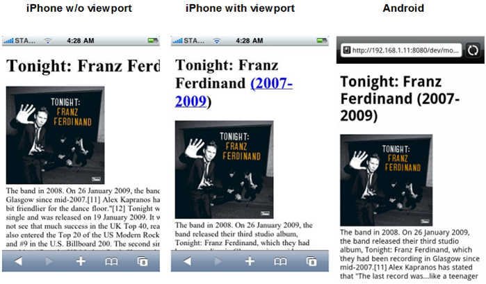

# Templating I
## Ejemplos

### Diseño Responsivo

#### Descarguemos los siguientes ejemplos:

#### Ejemplo 1: Viewports (Ventana de Visualización)

Puedes definir el ancho de la vista en el navegador. Si no utilizas `width=device-width`, tu página en iOS se estiraría en todo el ancho disponible del celular que es 920px. Si utilizas `width=device-width`, tu página encajaría en el tamaño real de la pantalla que es 320px. Entonces es recomendable incluir **siempre** la siguiente etiqueta dentro de nuestro `head`:

    <meta name="viewport" content="width=device-width">

#### Ejemplo 2: Media Queries

Los media queries de CSS3 son realmente simples en términos de su sintaxis. Tiene una directiva `@media`, estos *media type* especifican el soporte al cual apuntan los estilos css definidos dentro de ella: pantalla (screen), papel (print), móviles (handheld), etc. Algunas propiedades CSS están diseñadas para distintos medios. Sin embargo, para nuestro interés utilizamos simplemente:

    @media screen and (max-width:500px) {
      <!--introducimos acá el css-->
    }

Finalmente es recomendable utilizar `only screen` en vez de únicamente `screen` para evitar que navegadores antiguos que **no reconocen** media queries no lean el CSS que está dentro. Por lo que nuestro **media query** quedaría así:

    @media only screen and (min-width:640px) {
      <!--introducimos acá el css-->
    }

Como habrán visto, utilizamos `max-width` y `min-width`, los cuales indican el ancho máximo y mínimo, respectivamente, en el que el navegador interpretará los estilos CSS introducidos dentro de los corchetes.

##### ¿Pero dónde ubicamos estos **media queries**?

Pues al final de nuestro documento CSS. Ya que así serán interpretado y sobre escribirán cualquier otro estilo que ya hayamos escrito. Por ejemplo:

    html { background: red; }

    @media (max-width: 600px) {
      html { background: green; }
    }

##### Y estos media queries también los podemos utilizar en cascada:

    html { background: red; }
    @media (min-width: 600px) {
      html { background: green; }
    }
    @media (min-width: 800px) {
      html { background: blue; }
    }

Y si esta configuración de arriba es complicada para ti, pues podrías utilizar también la siguiente, que es lo mismo:

    @media (max-width: 599px) {
      html { background: red; }
    }
    @media (min-width: 600px) and (max-width: 799px) {
      html { background: green; }
    }
    @media (min-width: 800px) {
      html { background: blue; }
    }

## Ejercicios

Pero antes de continuar, reforcemos lo que hemos aprendido en esta primera sección con unos cuántos ejercicios muy simples.

### Ejercicio 1

a.Escriba un documento html que tenga como titulo "Programación" y que redacte brevemente acerca de programación incluya cabeceras, parrafos, divisiones, una tabla que enumere los cursos que desearia aprender.

### Ejercicio 2

b.Escriba un documento html con un formulario que pregunte por datos como nombre, apellido, cursos, notas, fecha de ingreso, un botón para subir una foto y un boton final para "enviar".

## Cuestionario

> 1.¿Cuál es la etiqueta para definir links?

a. `
`

b. `<a>`

c. ``

d. `
`

> 2.¿Cuales son las partes principales de un documento html?

a. `<form>` y `<table>`.

b. `<style>` y `<script>`.

c. `<head>` y `<body>`.

d. Todas las anteriores.

> 3.¿Qué etiquetas no se cierran?

a. ` `.

b. `<base>`.

c. ``.

d. Todas las anteriores.

> 4.¿Cuál es la forma correcta de crear un vínculo?

a. `<a target="http://www.unsitio.com">...</a>`

b. `<a href="http://www.unsitio.com">...</a>`

c. `<a url="http://www.unsitio.com">...</a>`

d. Ninguna de las anteriores.

> 5.¿Cómo definimos un área de texto? 

a. `<textarea>`

b. `<input type="textarea">`

c. `<input type="text">`

d. Ninguna de las anteriores.
